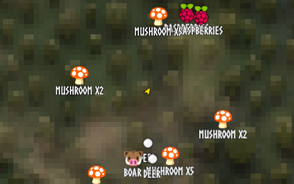
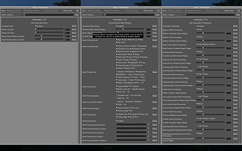
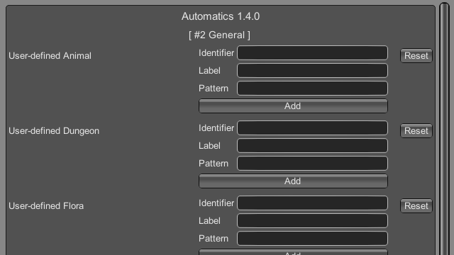

# Automatics - Valheim Mod

Automatics is a mod that automates the tedious tasks of life in Valheim. Most of its features exist in existing mods, but it has been re-designed to make it easier for me to use.

> **IMPORTANT**
>
> - This mod has been developed by an individual and is not associated with the game's developer in any way. Please refrain from asking the developer any questions regarding this mod.
> - This mod has been developed with the sole intention of single-player usage. Please be aware that it is not supported for server operation, and we kindly request your understanding in this matter.

## Features

> **TIP**: Each of the features described below can be completely disabled using the "Disable Module" option in the configuration.

### Automatic door

Automatically opens and closes allowed doors near the player. The open and close intervals, detection distances, allowed doors, optional enable/disable shortcut, and toggle message position can be changed from the configuration.

### Automatic mapping

Automatically pins nearby dynamic objects, static objects, and locations to the map, including animals, monsters, flora, minerals, vehicles, portals, dungeons, spots, and other configured objects. You can configure search ranges, allowed targets, static pin saving, destroyed-object pin cleanup, and user-defined objects. The map navigation shortcut starts or clears navigation by holding the configured modifier key (Left Shift by default) and left-clicking a pin on the large map; while navigating, the HUD shows the target name and distance.

**Custom icon pack:** You can also define your own icons in png and json files. See [docs/custom-icon-pack.md](docs/custom-icon-pack.md) for custom icon pack specifications.

### Automatic processing

Uses nearby allowed containers to automate supported processing tasks: supplying materials for crafting, refueling, storing produced items, and charging pieces such as Ballista. Per-piece operations, container search ranges and limits, stop thresholds, and the storage connection effect color can be changed from the configuration.

### Automatic feeding

Allows configured tamable creatures to eat valid food from nearby containers, the player's inventory, or both instead of only food dropped on the ground. Feeding range, animal types, and whether animals must move close to the feed can be changed from the configuration.

### Automatic repair

Automatically repairs items when the player is near usable crafting stations or, if enabled, when the crafting station GUI is opened. It can also repair nearby pieces while a build tool such as a hammer is equipped.

### Automatic mining

Automatically mines allowed minerals around the player. Mining can run at the configured interval or only when the mining shortcut is pressed, and it can require a pickaxe or wishbone for underground minerals.

### Automatic pickup

Automatically picks up nearby items at the configured interval when no Pickup All Nearby shortcut is assigned. If the shortcut is assigned, interacting with a pickable object while pressing it picks up matching nearby objects instead of running interval pickup.

## Console commands

Automatics add a few commands to help the user.

### automatics

**Usage**: `automatics (OPTIONS...)`

Displays the usage of commands added by Automatics.

#### OPTIONS

| Option | Description |
| --- | --- |
| `-i, --include=VALUE` | Show only commands whose names include the word specified in this option. |
| `-e, --exclude=VALUE` | Exclude commands whose names contain the word specified with this option. |
| `-v, --verbose` | Displays detailed usage of the command. |
| `-h, --help` | Displays a help message and exits the command. |

### printnames

**Usage**: `printnames (OPTIONS...) (WORD|REGEXP)...`

Outputs internal or display names that contain the specified string or match the specified regular expression. If multiple arguments are specified, only those matching all of them will be output.

#### WORD

A text contained in the internal or display name. (e.g. `$enemy_`, `$item_`, `$piece_`, `Boar`, `Mushroom`, `Wood door`); All partially matching internal and display names are output.

#### REGEXP

A regular expression of the internal or display name to be output. Must be prefixed with r/ (e.g. `r/^[$]item_`, `r/^boar$`)

#### OPTIONS

| Option | Description |
| --- | --- |
| `-h, --help` | Displays a help message and exits the command. |

#### Examples

- `printnames ling r/^[$]enemy_`
- `printnames r/^[$@]location_.+(?<!_(enter|exit))$`
- `printnames mushroom r/^[$]item_.+(?<!_description)$`

### printobjects

**Usage**: `printobjects [TYPE] (OPTIONS...)`

Display objects that can be handled by Automatics in the nearby.

> **NOTE**: The result of this command may show objects that you feel are not of the target type. For example, a Flint appear in the Flora search. This is not a bug but means that Automatics can treat Flint as Flora.

#### TYPE

Type of object to be displayed. Specify one of the following: animal, container, door, dungeon, flora, mineral, monster, spawner, spot, vehicle, other.

#### OPTIONS

| Option | Description |
| --- | --- |
| `-r, --radius=VALUE` | Specify the range within which the object is to be searched. [Default: 32] (Unit: Meters) |
| `-n, --number=VALUE` | Specify how many objects matching the condition are to be displayed. [Default: 4] |
| `-i, --include=VALUE` | Show only objects whose internal or display names match the word specified in this option. It works as a regular expression by concatenating r/ at the beginning of the string. |
| `-e, --exclude=VALUE` | Exclude objects whose internal names or display names match the word specified with this option. It works as a regular expression by concatenating r/ at the beginning of the string. |
| `-h, --help` | Displays a help message and exits the command. |

### removemappins

**Usage**: `removemappins (OPTIONS...)`

Remove map pins that match the specified conditions. If no options are specified, all duplicate pins will be deleted.

> **NOTE**: Please disable the "Automatic Mapping" feature before using this command. It may cause malfunctions.

#### OPTIONS

| Option | Description |
| --- | --- |
| `-r, --radius=VALUE` | Specify the maximum distance from the player's position to the pin to be removed. If set to 0, all pins will be targeted. [Default: 0] (Unit: meters) |
| `-i, --include=VALUE` | Pins that contain the specified string in their name will be targeted for deletion. |
| `-e, --exclude=VALUE` | Pins that contain the specified string in their name will be excluded from the deletion target. |
| `-n, --dry-run` | Enables the dry run mode. When this option is specified, pin deletion will be skipped, and only text output to the console will be performed. |
| `-d, --dangerous-mode` | When this option is specified, non-duplicate pins will also be included in the deletion target. Please use this option with caution, as incorrect usage can result in the deletion of all pins on the map. |
| `-h, --help` | Displays a help message and exits the command. |

## Configurations

I recommend using [Configuration Manager](https://github.com/BepInEx/BepInEx.ConfigurationManager).

*The README would be too large if we described all the details of the configuration, so we split it into separate file.*

Open [CONFIG.md](CONFIG.md) to see the configuration details.

### Adding object definitions to Automatics

You can use the [Configuration Manager](https://github.com/BepInEx/BepInEx.ConfigurationManager) to define objects that you want Automatics to work with.

Open [docs/add-user-defined-object.md](docs/add-user-defined-object.md) to learn more about adding user-defined objects.

## Supplementary explanation

### Matching by "Display name" and "Internal name"

In some features of Automatics, there is an option that allows the user to add targets as needed. The "Display name" and "Internal name" are used to identify these targets. The display name and internal name are matched according to different rules.

#### Display name

Display names are the names that appear in the game, such as Boar, Deer, Dandelion, etc. The matching rule for "Display name" is a partial match, meaning that if the target display name contains the specified string, it matches. It is case-insensitive.

#### Internal name

Internal names are the names used inside the game program, such as `$enemy_boar`, `$enemy_deer`, `$item_dandelion`, etc. The matching rule for "Internal name" is an exact match, meaning that if the target internal name is identical to the specified string, it matches. It is case-insensitive. Note that internal names for translations added by Automatics are prefixed with `@`, not `$`, as in `@internal_name`

##### Matching Samples

**Target data**

| Display name | Internal name |
| --- | --- |
| Greyling | $enemy_greyling |
| Greydwarf | $enemy_greydwarf |
| Surtling | $enemy_surtling |

**Matching result**

| | Grey | ling | $enemy_greyling | $enemy_greydwarf | $enemy_ |
| --- | --- | --- | --- | --- | --- |
| Greyling | Match | Match | Match | No match | No match |
| Greydwarf | Match | No match | No match | Match | No match |
| Surtling | No match | Match | No match | No match | No match |

## Languages

| Language | Translators | Status |
| --- | --- | --- |
| English | Translation Tools | 100% |
| Japanese | EideeHi | 100% |

## Contacts

[Open an issue](https://github.com/eideehi/valheim-automatics/issues) for bug reports, questions, suggestions, and requests.

## Credits

- **Dependencies**:
  - [Configuration Manager](https://github.com/BepInEx/BepInEx.ConfigurationManager)
  - [LitJSON](https://litjson.net)
  - [NDesk.Options](http://ndesk.org/Options)

## License

Automatics is developed and released under the MIT license. For the full text of the license, please see the [LICENSE](LICENSE) file.
