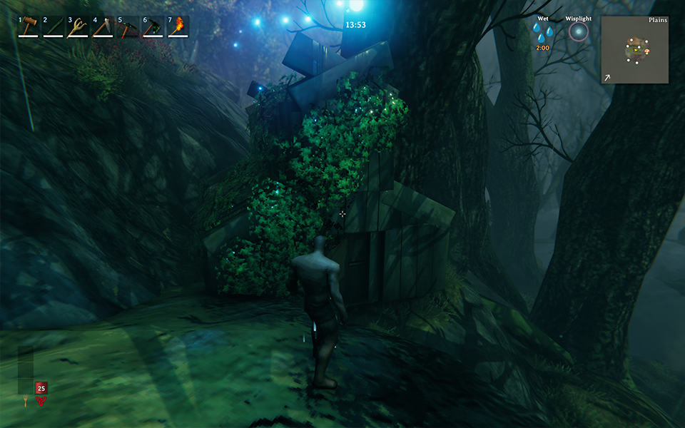
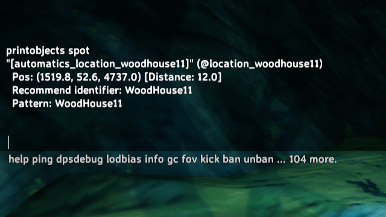
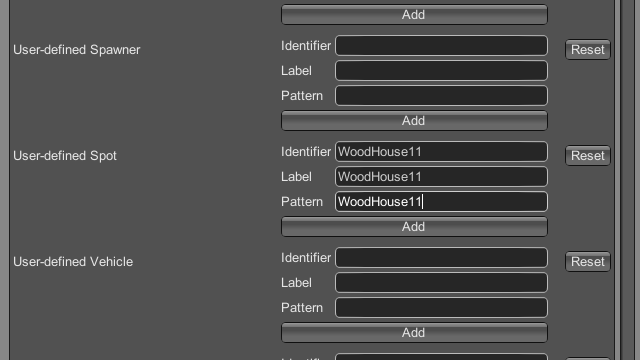
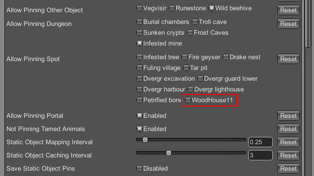
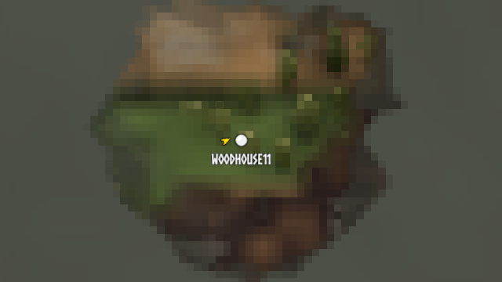
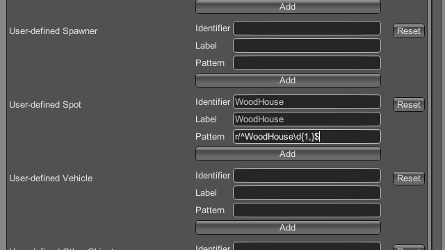
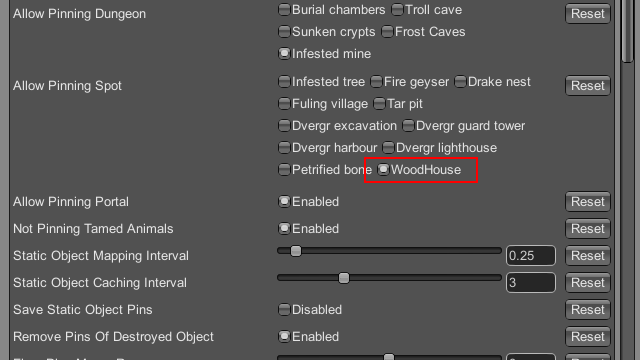
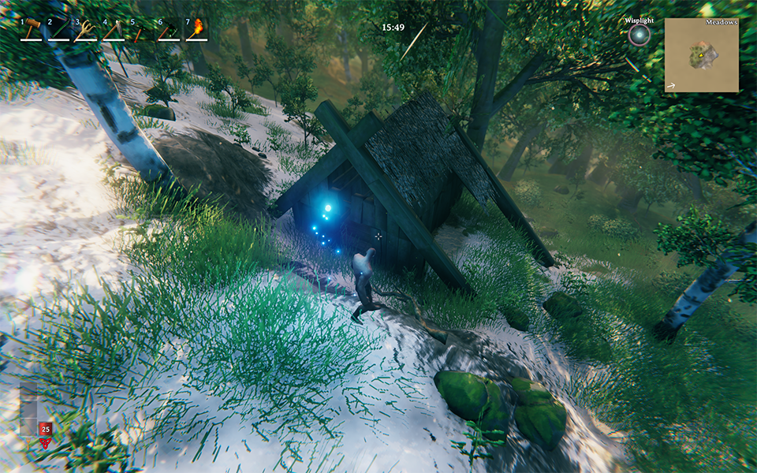
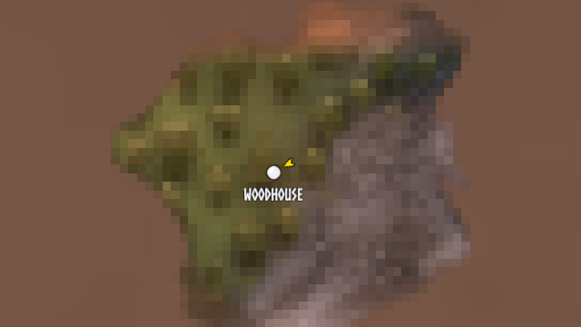
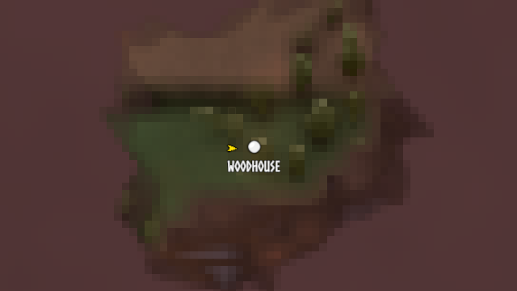

# Add user-defined object to Automatics

In Automatics 1.4.0, the method of adding user-defined objects has been changed. In addition, a `printobjects` console command has been added to assist users in adding object definitions.

In this page, as a tutorial, we will add an object definition to automatically pin wooden houses to the map.

1. First, find a wooden house.

   

2. Next, run the console command `printobjects spot`.

   

   The name of this wooden house turned out to be `WoodHouse11`.

   > **NOTE**: Depending on the house you found, the last number may be different. In that case, replace the number with the one for the house you found.

3. Open "Configuration Manager" and register WoodHouse11 in the "User-defined Spot" option. (Don't forget to press the Add button)

   **Information to register**

   | Field | Value |
   | --- | --- |
   | Identifier | WoodHouse11 |
   | Label | WoodHouse11 |
   | Pattern | WoodHouse11 |

   

4. If you go to the "Allow Pinning Spot" option, you will see that WoodHouse11, which you just registered, is available for selection, so click on it to enable it.

   

5. Check the map and you will see that WoodHouse11 is pinned.

   

   Now that WoodHouse11 can be pinned. However, there is one problem. As you may have noticed, this does not pin other wooden houses such as WoodHouse1 and WoodHouse10. You can register one by one, but there is a better way. That should use regular expressions.

6. Let's remove the WoodHouse11 just registered, and register a new definition using a regular expression.

   **Information to register**

   | Field | Value |
   | --- | --- |
   | Identifier | WoodHouse |
   | Label | WoodHouse |
   | Pattern | `r/^WoodHouse\d{1,}$` |

   

   Don't forget to enable it under "Allow Pinning Spot".

   

7. The house is now pinned in a different shape than the WoodHouse11.

   

   

   You can see that WoodHouse11 is also pinned properly.

   
